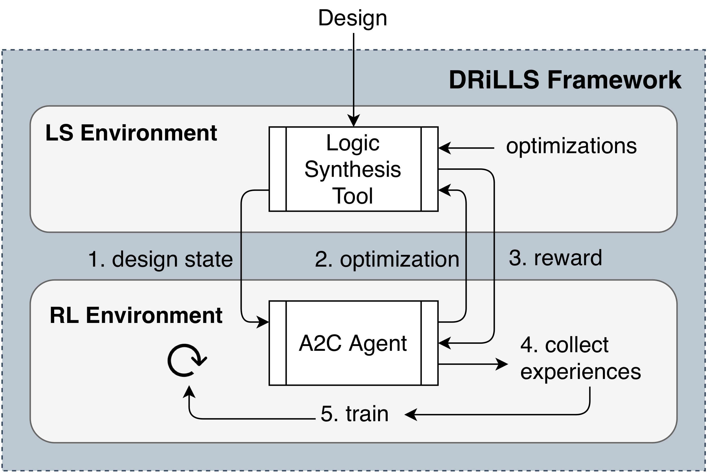

# DRiLLS 
Deep Reinforcement Learning for Logic Synthesis Optimization

## Abstract
Logic synthesis requires extensive tuning of the synthesis optimization flow where the quality of results (QoR) depends on the sequence of opti-mizations used.  Efficient design space exploration ischallenging due to the exponential number of possible optimization  permutations. Therefore,  automating the optimization process is necessary. In this work, we propose a novel reinforcement learning-based methodology  that  navigates  the  optimization  space  without human intervention.  We demonstrate the training of an Advantage Actor Critic (A2C) agent that seeks to minimize area subject to a timing constraint.  Using the proposed framework, designs can be optimized autonomously with no-humans in-loop.

## Citation
Preprint will be available soon!

## Setup
DRiLLS requires `Python 3.6+`, `pip3` and `virtualenv` installed on the system.

1. `virtualenv .venv`
2. `source .venv/bin/activate`
3. `pip install -r requirements.txt`

## How It Works

There are two major components in DRiLLS framework: 

* **Logic Synthesis** environment: a setup of the design space exploration problem as a reinforcement learning task. The logic synthesis environment is implemented as a session in [drills/scl_session.py](drills/scl_session.py) and [drills/fpga_session.py](drills/fpga_session.py).
* **Reinforcement Learning** environment: it employs an *Advantage Actor Critic agent (A2C)* to navigate the environment searching for the best optimization at a given state. It is implemented in [drills/model.py](drills/model.py) and uses [drills/features.py](drills/features.py) to extract AIG features.

For more details on the inner-workings of the framework, see Section 4 in the paper.

## Reporting Bugs
Please, use [ISSUE_TEMPLATE/bug_report.md](.github/ISSUE_TEMPLATE/bug_report.md) to create an issue and describe your bug.

## Contributing
Below is a list of suggested contributions you can make. Before you work on any, it is advised that you create an issue using the [ISSUE_TEMPLATE/contribution.md](.github/ISSUE_TEMPLATE/contribution.md) to tell us what you plan to work on. This ensures that your work can be merged to the `master` branch in a timely manner.

### Modernize Tensorflow Implementation
Google has recently released [Dopamine](https://github.com/google/dopamine) which sets up a framework for researching reinforcement learning algorithms. A new version of DRiLLS would adopt Dopamine to make it easier to implement the model and session classes. If you are new to Dopamine and want to try it on a real use case, it would be a great fit for DRiLLS and will add a great value to our repository.

### Better Integration
The current implementation interacts with the logic synthesis environment using files. This affects the run time of the agent training as it tries to extract features and statistics through files. A better integrations keeps a session of `yosys` and `abc` where the design is loaded once in the beginning and the feature extraction (and results extraction) are retrieved through this open session.

### Study An Enhanced Model
The goal is to enhance the model architecture used in [drills/model.py]. An enhancement should give better results (less area **AND** meets timing constraints):
* Deeper network architecure. 
* Changing gamma rate.
* Changing learning rate.
* Improve normalization.

## License
BSD 3-Clause License. See [LICENSE](LICENSE) file
